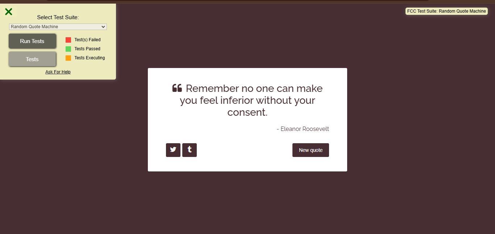
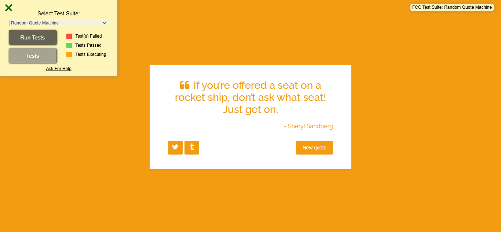

# RANDOM QUOTE GENERATOR APP

## 🌟 About the Project  

✨ Random Quote Generator

The Random Quote Generator is a simple yet inspiring web application that displays a new random quote every time the user clicks a button. It provides motivational, humorous, and thought-provoking quotes to keep users engaged.

✨ Features
Generates a random quote at the click of a button
Displays the author's name (if available)
Clean and responsive user interface
Option to generate a new quote instantly

🚀 Technologies Used

HTML
CSS
JavaScript

🔧 How It Works

Open the app in your browser.
Click the "New Quote" button to get a fresh quote.
Enjoy endless inspiration and motivation!

## 🚀 Live Demo  
🔗 [Visit the Website](https://form-validation-pi-vert.vercel.app/)

